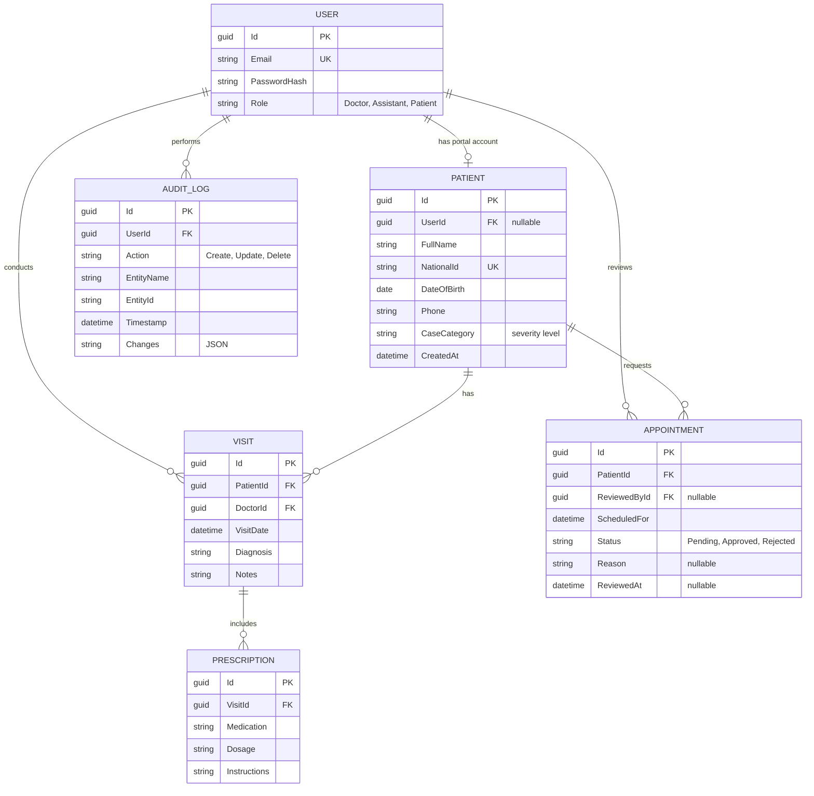

# 3iadaty: Entity Relationship Diagram

```mermaid
erDiagram
    USER ||--o| PATIENT : "has portal account"
    USER ||--o{ VISIT : "conducts"
    USER ||--o{ APPOINTMENT : "reviews"
    USER ||--o{ AUDIT_LOG : "performs"
    PATIENT ||--o{ VISIT : "has"
    PATIENT ||--o{ APPOINTMENT : "requests"
    VISIT ||--o{ PRESCRIPTION : "includes"

    USER {
        guid Id PK
        string Email UK
        string PasswordHash
        string Role "Doctor, Assistant, Patient"
    }

    PATIENT {
        guid Id PK
        guid UserId FK "nullable"
        string FullName
        string NationalId UK
        date DateOfBirth
        string Phone
        string CaseCategory "severity level"
        datetime CreatedAt
    }

    VISIT {
        guid Id PK
        guid PatientId FK
        guid DoctorId FK
        datetime VisitDate
        string Diagnosis
        string Notes
    }

    PRESCRIPTION {
        guid Id PK
        guid VisitId FK
        string Medication
        string Dosage
        string Instructions
    }

    APPOINTMENT {
        guid Id PK
        guid PatientId FK
        guid ReviewedById FK "nullable"
        datetime ScheduledFor
        string Status "Pending, Approved, Rejected"
        string Reason "nullable"
        datetime ReviewedAt "nullable"
    }

    AUDIT_LOG {
        guid Id PK
        guid UserId FK
        string Action "Create, Update, Delete"
        string EntityName
        string EntityId
        datetime Timestamp
        string Changes "JSON"
    }
```